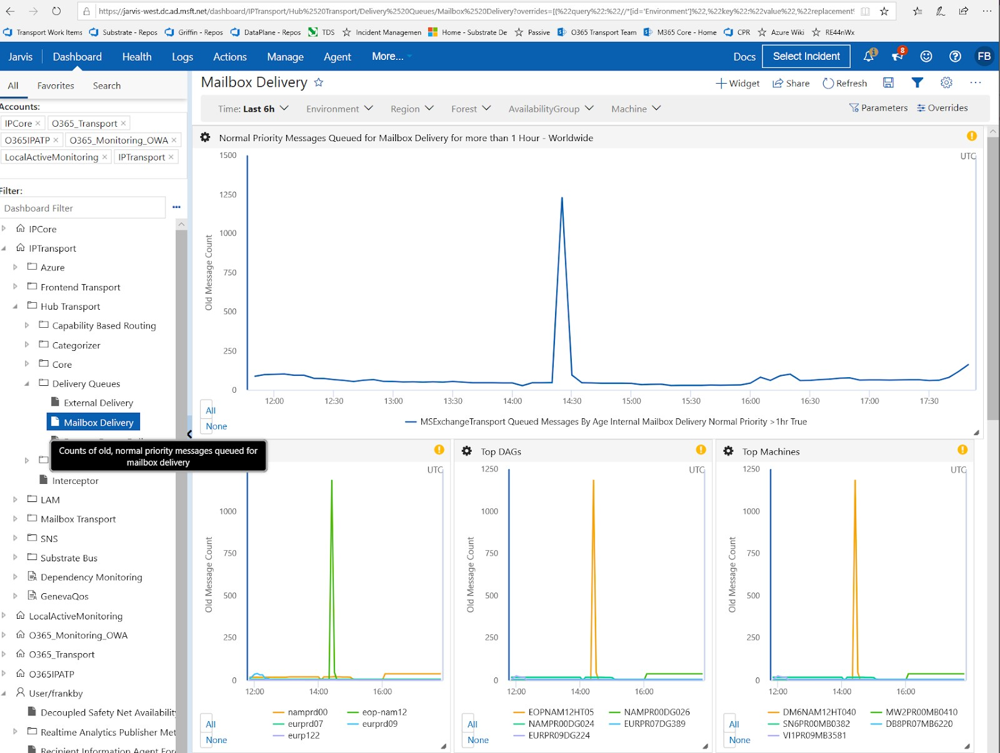

# QMBA Mailbox Delivery, Forest
Monday, September 24, 2018
10:32 AM

| Monitor Goal | Investigation Goal | Owner |
| ------------ | ------------------ | ------|
| Alert when normal priority messages across a forest have been queued in mailbox delivery for too long. | Messages queued in mailbox delivery will likely be dispersed across the entire forest. Attempt to find out why the old messages cannot be delivered to a mailbox or are de-prioritized. | frankby |

## What triggers the alert?
The signal for this alert is generated by the MailboxDeliveryQmbaProbe, which periodically measures the value of the MSExchangeTransport Queued Messages By Age / Internal Mailbox Delivery Normal Priority / >1hr performance counter and uploads its value to Geneva. The alert threshold for forest level is 1000.

A Geneva dashboard providing current and recent historical views of this data by time, forest, and availability group is available on the IPTransport account. There is also a link at the bottom of the Alert e-mail.

[QMBA Dashboard](https://jarvis-west.dc.ad.msft.net/dashboard/share/91E7368C?overrides=%5b%7b%22query%22:%22//*%5bid='Environment'%5d%22,%22key%22:%22value%22,%22replacement%22:%22%22%7d,%7b%22query%22:%22//*%5bid='Region'%5d%22,%22key%22:%22value%22,%22replacement%22:%22%22%7d,%7b%22query%22:%22//*%5bid='Forest'%5d%22,%22key%22:%22value%22,%22replacement%22:%22%22%7d,%7b%22query%22:%22//*%5bid='AvailabilityGroup'%5d%22,%22key%22:%22value%22,%22replacement%22:%22%22%7d,%7b%22query%22:%22//*%5bid='Machine'%5d%22,%22key%22:%22value%22,%22replacement%22:%22%22%7d%5d%20)

## Possible root causes
1. Hot delivery, single delivery server: All queued messages are targeting the same delivery server.
2. Hot hub, single hub server can't send messages out: Likely an authorization error. All queued messages are in the same hub server.
3. Scattered hub and scattered delivery: Messages of a pattern have been queued. 
4. Networking failure, café failure.

## Diagnose and Recovery
1. Once alerted, open the [QMBA Dashboard](https://jarvis-west.dc.ad.msft.net/dashboard/share/91E7368C?overrides=%5b%7b%22query%22:%22//*%5bid='Environment'%5d%22,%22key%22:%22value%22,%22replacement%22:%22%22%7d,%7b%22query%22:%22//*%5bid='Region'%5d%22,%22key%22:%22value%22,%22replacement%22:%22%22%7d,%7b%22query%22:%22//*%5bid='Forest'%5d%22,%22key%22:%22value%22,%22replacement%22:%22%22%7d,%7b%22query%22:%22//*%5bid='AvailabilityGroup'%5d%22,%22key%22:%22value%22,%22replacement%22:%22%22%7d,%7b%22query%22:%22//*%5bid='Machine'%5d%22,%22key%22:%22value%22,%22replacement%22:%22%22%7d%5d%20) to retrieve the latest queue status. 
Change this alert's urgency to Sev3 in forest while you are analyzing the alert.

2. Run Transport on-call script Diagnose-QRBA.ps1.

    a. If the script alerts a single delivery server, move the mailbox database out of the delivery server. 

    b. Run `check-deliveryhealth.sp1` in the "MDB Health Summary" session. If the MDBHealth is low and the error is DiskLatency, engage HA team. If messages are throttled by Disklatency in the "MDB Throttling Summary" session, engage HA team.

    c. Check provision status for delivery server.

    d. Refer to [this guide](HttpDeliveryAvailabilityV2Monitor) to diagnose the single delivery issue.

3. If Diagnose-QRBA.ps1 can't be run in **ITAR** environment, run the following two commands via Escort to locate hot delivery server.

* `Get-QueueDiversityV2 -forest`
    * This will list top target mdb-> $mdbGuid
* `Get-MailboxDatabase  $mdbGuid`         
    * This will locate where the mdb is mounted 

4. Check Geneva dashboard in the "Top Machines" chart at top queued hub server. If the machine's queued message count is similar to the forest queued messages count, this is a hot hub issue.

    a. Retrieve the last error of the queued messages to locate why messages were deferred in the delivery queue.
        `$q = get-queue -Server  BN3PR00MB0178  -Filter "DeliveryType -eq 'HttpDeliveryToExo'"`
        `$msg= get-message -Queue $q.Identity`
        `$msg.LastError`

    b. Download `HubTransportHttpSendLogsHourly` in the hub server for more details regarding the last error.

    `Get-MachineLog -target $server -Log HubTransportHttpSendLogsHourly` 

    c. Restart MSExchangeTransport.

    `Request-RestartService_V2.ps1 -Target   $server -ServiceName  MSExchangeTransport  -Reason "reason"`

5. If the error is neither hot delivery or hot hub, some patterned messages may have been queued.

    a. Check messages in delivery queue, check last error to see if queued messages reveal a pattern.

    `Get-QueueDiversityV2 -Forest -Priority normal  -QueueFilter {DeliveryType -eq 'HttpDeliveryToExo'}    -MinMessageLatency "01:00:00"`

    b. Check [Delivery Hang Dashboard](https://jarvis-west.dc.ad.msft.net/dashboard/O365_Transport/MailboxTransport/Delivery/DeliveryHangException) to check forest delivery hang status. If hang exception has significantly increased, it may cause messages to queue. Engage other team based on hang call stack. 

    Note: Mitigation action may drop the messages causing the delivery hang. Check the message ID to find a common pattern in the messages.