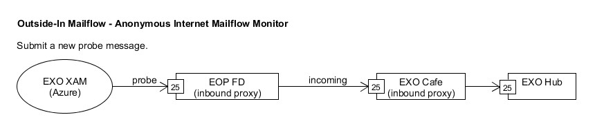

# XAM SMTP Internet - Enterprise (EXO + EOP)
Monday, October 10, 2016
10:28 AM
 
## Monitor Goals
Monitor path of mail transmission through internet submission of mail to EOP FD through EXO HUB. This probe runs and alerts on the following scopes:
1. **EXO Dag scope**: This alerts on a Dag level when availability goes down.
2. **FOREST level RED ALERT**: A system-wide Incident/Red Alert is issued when across Forest availability declines for any reason.
3. **EOP FOREST scoped**: This alerts on a EOP Forest level instead of conventional EXO focused scope. This will include issues faced until EOP FD successfully proxies incoming mail to EXO HUB. 
 
## What does the probe do?

Each probe execution follows these steps:
1. Resolve MX of monitoring tenant.
2. Connect to monitoring tenant's MX host; this should resolve to an EOP FD.
3. Negotiate SSL connection.
4. Submit email to monitoring mailbox.
 
## What triggers the alert?
This monitor targets a specific Dag/EXO forest/EOP. An alert is raised when the percentage of successful probes in the last hour drops below 97.5%, monitoring profile-specific threshold.
 
## Possible root causes
1. **GLS issue**: Cannot attribute mail because GLS is not accessible, or monitoring tenant cannot be found in GLS.
2. **Networking issue**: Cannot resolve tenant's MX (DNS++ issue), VIP not configured correctly, connectivity issues between Azure instance, EOP FD, EXO Café and/or EXO Hub, etc.
3. **Certificate issue**: Wrong or expired certificate; monitoring mailbox not provisioned or configured correctly.
4. **Transport issue**: EOP FD, EXO Café or EXO Hub too busy, or in a bad state (i.e. crashing). There may also be a code bug in any of these transport components.
 
## Link to OSP
[EXO Dag Scoped (XAM SMTP - Internet)](https://o365pulse.office.net/enterprisedashboard?probe=SMTP%20Internet%20-%20Enterprise&environment=Prod&scope=*.*.*)
 
[EOP Forest Scoped (XAM SMTP EOP - Internet)](https://o365pulse.office.net/enterprisedashboard?probe=SMTP%20Internet%20-%20Enterprise%20EOP&environment=Prod&scope=*.*.*)
 
## Diagnose and Recovery
### Step 1 - Determine Prominent Error Type and SMTP Error Responses
* Check alert mail table at bottom of page to locate the prominent error type or OSP page link in email.
* Identify the components involved in the failure... 
    * UnableToConnect - Azure and EOP FD
    * ReplicationFailure - EXO Hub
    * ProxyDnsFailure - EOP FD, EXO Café
    * ProbeTimeout - Check if "250 Recipient OK" in OSP, EOP FD, or EXO Hub is listed in last response.
        * Use `"Get-NetworkConfig.ps1 -Server CY1USG02FT013 -PortConnectivity (2001:489a:2200:408::3):25 -ShowConnectionResponse"` to see if the connection can be established and if banner can be read successfully.
        
        `Port 25 Connectivity Status: Passed uses 12.803 ms Can't get remote side answer.`
 
* **Prominent failure reasons can be found in body of alert email or in OSP.** 
  

See [Outside-In Probe Prominent Failure Reason]() for more information.

#### Mitigation Steps, Description of Each Error Type and SMTP Response
Once you've determined the error type, see the following pages for additional information.
[Common Outside In SMTP Probe Failures]()
[Understand Outside-In Class of Failures]()
 
### Step 2 - Retrieve Probe SMTP Sessions From Protocol Logs
* After identifying error type, select error from OSP to retrieve protocol logs.
    * Use EHLO domain for probe
    * Pick up time of the probe 
    * Retrieve protocol logs
* Use on-call script to diagnose logs 
* Help for using script: [Get a XAM Probe's Protocol logs]()
 
 
## Diagnose EOP Issues
 
SMTP Internet - Enterprise workflow starts a SMTP conversation with EOP FD in a sequence. EOP FD sets up a proxy connection to EXO Café and proxies the SMTP commands on BDAT. 
Issues Pre BDAT command are specifically EOP issues. 
Issues Post BDAT command can be differentiated between EOP and EXO.
* EOP related issues - Setting up a proxy (Error Type: PROXYDNSFAILURE) 
* EXO related issues - Hub server busy or replication failure
* To further identify the EOP and EXO issues, take the following steps:
    * Go to OSP.
    * Look at scopes of failures at EOP Forest level, and check for availability at Dag level on the right column of the OSP health page.
    * If errors are concentrated on a Dag, check availability of SMTP Internet via Enterprise Dag.
    * If errors are distributed over multiple dags, verify if prominent error type happens before BDAT command, or if it is a proxy connection failure.